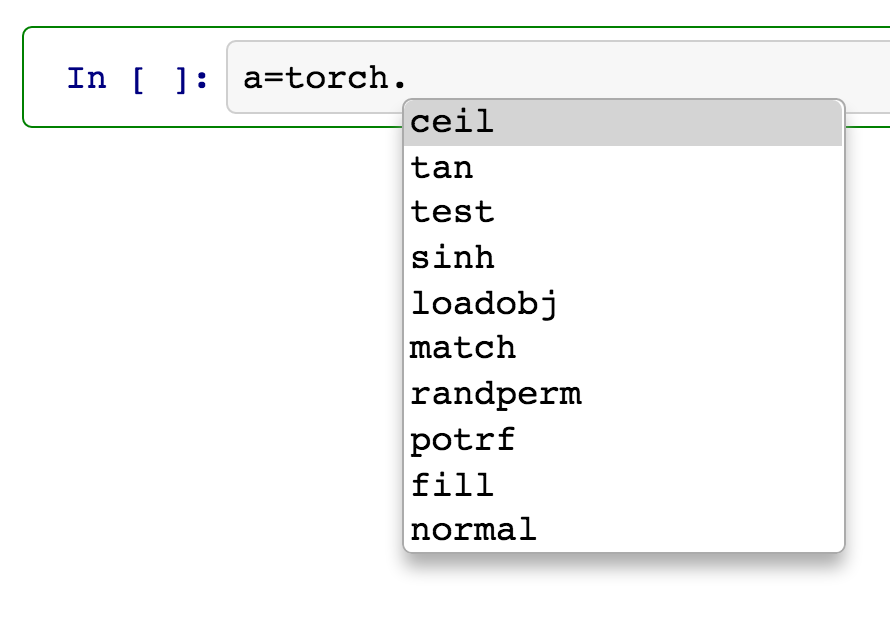
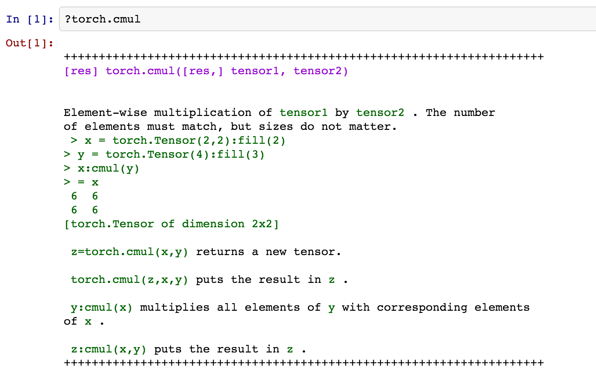
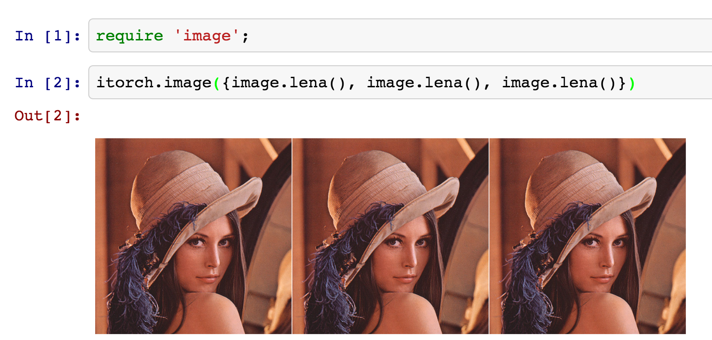
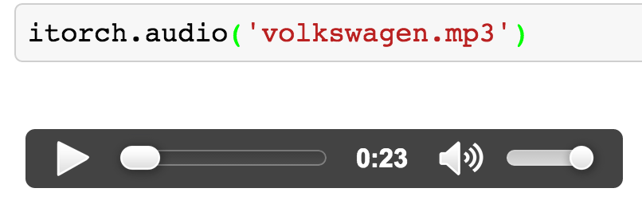
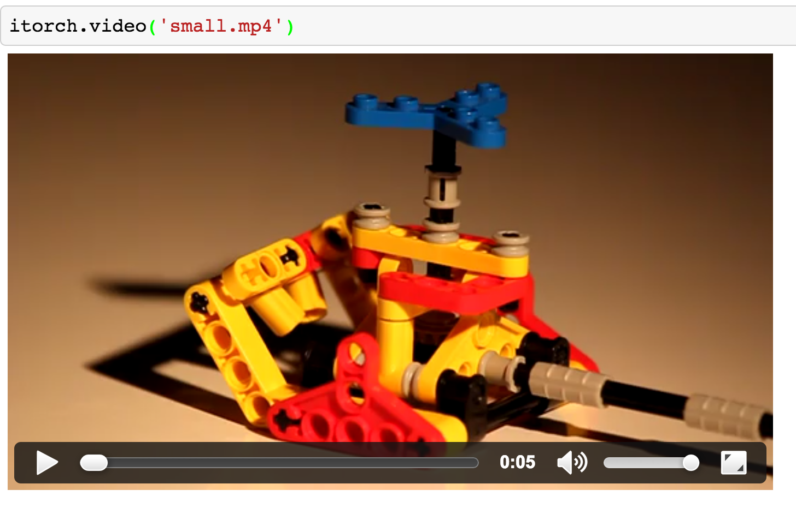
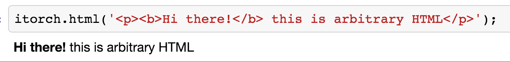
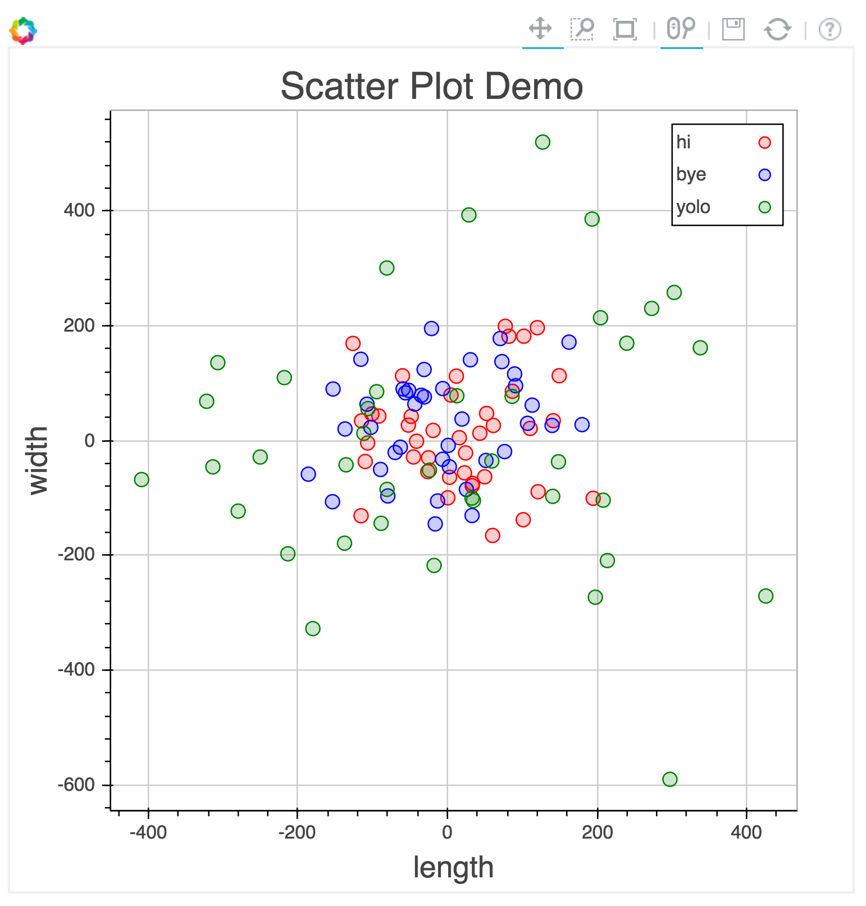
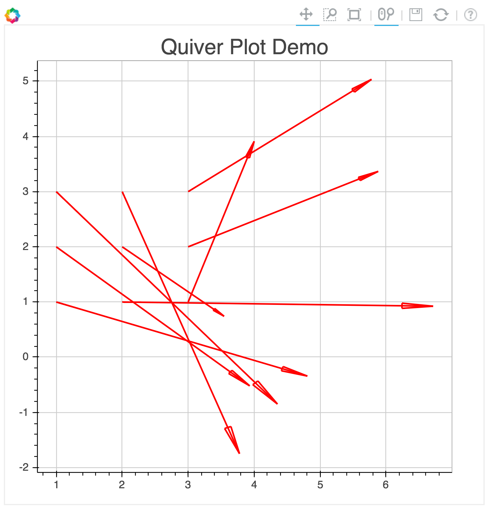

# iTorch
iTorch is an [IPython](http://ipython.org) Kernel for Torch, with plotting (using [Bokeh.js](http://bokeh.pydata.org/docs/gallery.html) plots) and visualization of images, video and audio

## Features
iTorch in notebook mode works like any other IPython notebook.  
It provides useful **inline auto-complete**. Whenever you need auto-complete, use the **TAB key**.  


It also provides **inline help** using the ? symbol.
For example, `?torch.cmul`


In addition, we introduce visualization functions for images, video, audio, html and plots.

**itorch.image(img)** - You can pass in a 3-D tensor (for a single image), or a table of 3D tensors (image collages).
```lua
  itorch.image({image.lena(), image.lena(), image.lena()})
```


**itorch.audio(path)** - You can pass in a filename of an audio file. Formats supported are mp3, ogg, aac
```lua
itorch.audio('example.mp3')
```


**itorch.video(path)** - You can pass in a filename of a video file. Formats supported are mp4, ogv, mpeg
```lua
itorch.video('example.mp4')
```


**[window-id] = itorch.html(htmlstring, [window-id])** - Raw HTML string that is passed is rendered. A window handle is returned, that can be reused to replace the HTML with something else.
```lua
itorch.html('<p><b>Hi there!</b> this is arbitrary HTML</p>')
window_id = itorch.html('<p>This text will be replaced in 2 seconds</p>')
os.execute('sleep 2')
itorch.html('<p>magic!</p>', window_id)
```


###Plotting
iTorch can plot to screen in notebook mode, or save the plot to disk as a html file.

A Plot object is introduced, that can plot different kinds of plots such as scatter, line, segment, quiver plots.  
The plotting can be extended to more kinds of plots, as it uses [Bokeh.js](http://bokeh.pydata.org/en/latest/docs/reference/bokehjs.html) as its backend.
```lua
x1 = torch.randn(40):mul(100)
y1 = torch.randn(40):mul(100)
x2 = torch.randn(40):mul(100)
y2 = torch.randn(40):mul(100)
x3 = torch.randn(40):mul(200)
y3 = torch.randn(40):mul(200)
Plot = require 'itorch.Plot'

-- scatter plots
plot = Plot():circle(x1, y1, 'red', 'hi'):circle(x2, y2, 'blue', 'bye'):draw()
plot:circle(x3,y3,'green', 'yolo'):redraw()
plot:title('Scatter Plot Demo'):redraw()
plot:xaxis('length'):yaxis('width'):redraw()
plot:legend(true)
plot:redraw()
-- print(plot:toHTML())
plot:save('out.html')
```


```lua
-- line plots
plot = Plot():line(x1, y1,'red','example'):legend(true):title('Line Plot Demo'):draw()
```

```lua
-- segment plots
plot = Plot():segment(x1, y1, x1+10,y1+10, 'red','demo'):title('Segment Plot Demo'):draw()
```

```lua
-- quiver plots
U = torch.randn(3,3):mul(100)
V = torch.randn(3,3):mul(100)
plot = Plot():quiver(U,V,'red',''):title('Quiver Plot Demo'):draw()
```


## Requirements
iTorch requires or works with
* Mac OS X or Linux (tested in Ubuntu 14.04)
* [Torch-7](https://github.com/torch/torch7/wiki/Cheatsheet#installing-and-running-torch)
* [IPython](http://ipython.org/install.html)
* ZeroMQ
```bash
# OSX
brew install zeromq

# Ubuntu
sudo apt-get install libzmq3-dev
```

## Installing iTorch
```bash
git clone https://github.com/facebook/iTorch.git
cd iTorch
luarocks make 
```

## How iTorch works
Start iTorch at command-line using the following command:
```bash
itorch notebook  # notebook mode
OR  
itorch  # console mode
OR  
itorch qtconsole  # Qt mode
```

## Examples
Demo iTorch notebook: http://nbviewer.ipython.org/github/facebook/iTorch/blob/master/iTorch_Demo.ipynb

## Join the Torch community
See the CONTRIBUTING file for how to help out.

## License
iTorch is BSD-licensed. We also provide an additional patent grant.

